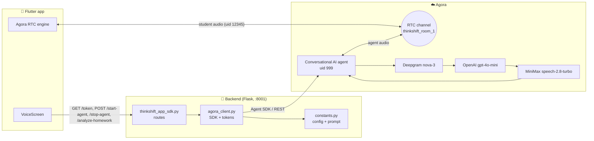
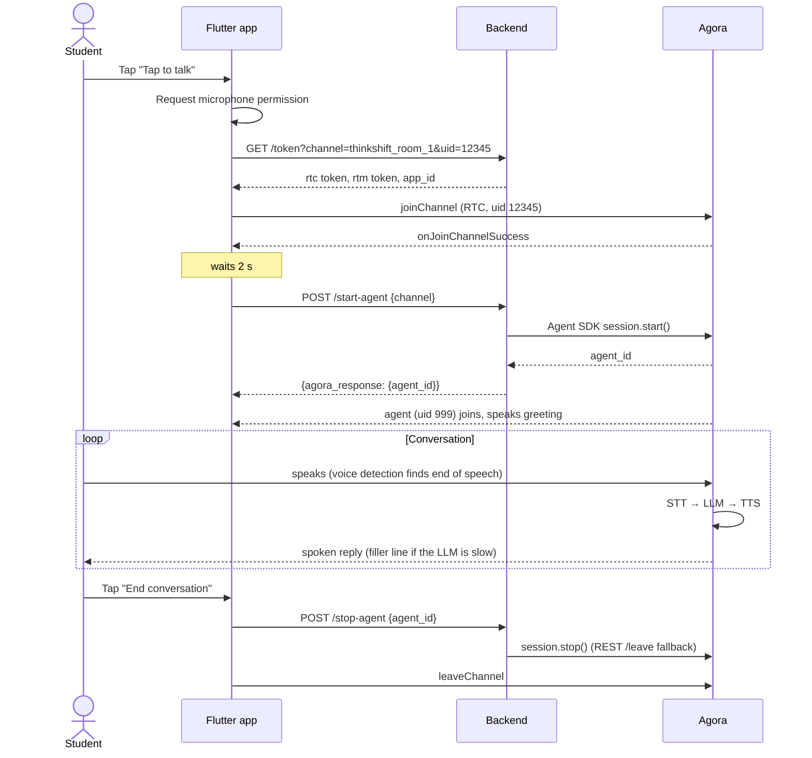
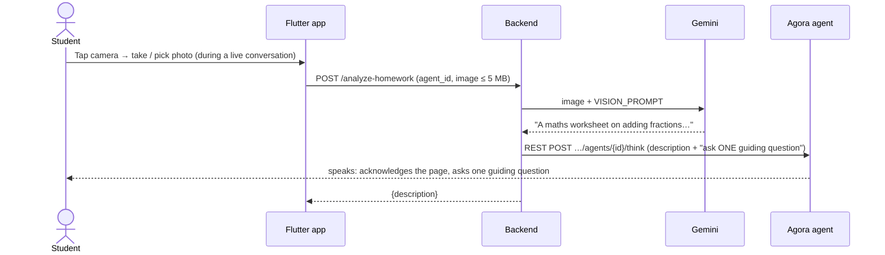

# Architecture

ThinkShift AI has three parts:

1. **Flutter app**: captures the student's voice and plays the agent's voice over **Agora RTC**.
2. **Python backend**: holds the Agora secrets, generates tokens, and starts or stops the AI agent with the **Agora Agent SDK**.
3. **Agora Conversational AI**: a cloud agent that joins the same RTC channel and runs the speech → LLM → speech pipeline.

The app never talks to the AI directly. It only sends and receives audio in an RTC channel. The agent is just another participant in that channel.

## Conversation lifecycle

## Backend design

### Sync Flask, async SDK

Flask handles each request synchronously, but `agora-agents` is an async SDK. `agora_client.py` starts **one background asyncio event loop** in a daemon thread. Every SDK call goes to that loop through `asyncio.run_coroutine_threadsafe`. This keeps the shared `httpx.AsyncClient` and all agent sessions on the same loop. For the same reason, Flask runs with `use_reloader=False`: the reloader would start a second process with its own loop.

### Agent configuration

`agora_client._build_agent()` builds the agent on every `/start-agent` call:

| Setting | Value | Why |
|---|---|---|
| STT | Deepgram `nova-3`, `ASR_LANGUAGE` | Agora-managed, no vendor key needed |
| LLM | OpenAI `gpt-4o-mini`, temperature `0.4`, history `15` | A lower temperature makes the model follow the one-question rule more consistently |
| TTS | MiniMax `speech-2.8-turbo`, `English_radiant_girl` | Agora-managed |
| Turn detection | Voice detection: speech threshold `0.5`, interrupt after `160 ms`, end of turn after `640 ms` of silence | Responsive turn-taking |
| Interruption | `start_of_speech` | The student can talk over the agent at any time |
| Filler words | After `1500 ms`, a generated line in the student's language, with a static phrase list as fallback | Avoids dead air while the LLM thinks |
| Audio scenario | `chorus` | Audio profile tuned for AI agents (echo and noise handling) |
| Data channel | RTM, error messages and metrics enabled | Ready for transcripts and agent state in the app |
| Idle timeout | `60 s` | The agent leaves if the channel is empty |

The **system prompt** (`constants.SYSTEM_PROMPT`) defines the ThinkShift persona. Its key rule is the *question rule*: if the agent's previous reply asked a question, the next reply must contain none. This caps each topic at one thinking question and prevents quiz loops.

### Session tracking and fallbacks

* Started sessions are kept in memory: `agent_id → session`.
* `/stop-agent` uses the in-memory session. If it isn't there (for example after a backend restart), the backend calls Agora's REST `POST …/agents/{id}/leave` with Basic auth (Customer ID / Secret).
* `/interrupt-agent` calls Agora's REST `POST …/agents/{id}/interrupt` directly, because `session.interrupt()` in `agora-agents` 2.8.1 sends a request with no body, which Agora rejects.

### Tokens

* **Student**: `/token` generates an RTC token (publisher role) and an RTM token for the requested uid. Both are valid for 1 hour.
* **Agent**: the SDK generates the agent's own token from the App ID and certificate. The backend never builds it by hand.

## Homework photo flow

* **Why not send the image to the agent directly?** The Agora Python SDK's `think`/`say` only accept text. Agora's own image messages need RTM in the app, a native client toolkit (not available for Flutter), and public image URLs. Describing the photo with Gemini and passing that text to the agent works with the setup we already have.
* **Privacy:** photos are processed in memory and sent only to Gemini. They are never saved to disk or hosted anywhere.
* The prompts live in `constants.py` (`VISION_PROMPT`, `HOMEWORK_THINK_TEMPLATE`). The Gemini call is in `vision_client.py`.

## Identifiers

| Name | Value | Where |
|---|---|---|
| Channel | `thinkshift_room_1` | `config.dart` |
| Student uid | `12345` | `config.dart` (must match the token, must not be `0`) |
| Agent uid | `999` | `constants.AGENT_UID` |
| Backend port | `8001` | `constants.SERVER_PORT` |

## Security notes

* Secrets live only in `backend/.env`. The app receives nothing but the public App ID and short-lived tokens.
* The backend has no authentication or rate limiting. It is meant for local or hackathon use only.
* `debug=True` together with `host=0.0.0.0` exposes Flask's debugger on the local network. Turn it off outside a trusted network.
